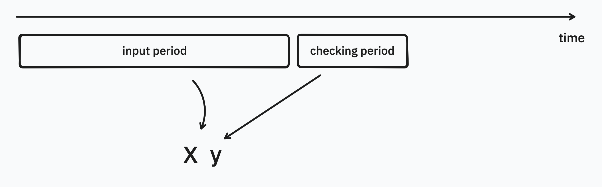
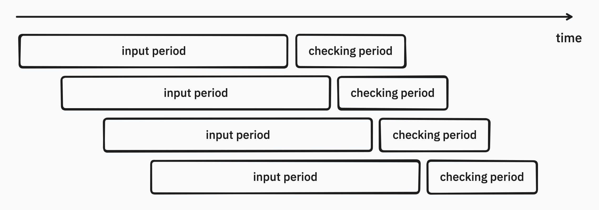

> This repository is currently mainly here to get the ball rolling on some ideas. If there is sufficient interest we'll gladly invest more time in it, but first we'd like to get some feedback. 
>
> We're mainly eager to confirm if this line of work is relevant to industry. 

# scikit-churn 

This repository explores some moments where data leakage can occur in churn-related use-cases. You may need more than a scikit-learn pipeline to protect you against temporal data leaks. 

The approach for now is to construct a generator that can generate `X`,`y` pairs from temporal data. You'd still need to provide a function to construct features, but the generator can at least guarantee that you're only generating features that don't peek into the future.

Imagine that you're interested in doing some churn research. That is to say, you're interested in predicting if somebody is going to be around in the future. Then you might want to construct your data using the following conceptual model. 



There's a "checking" period where you're going to check who is still around. And this is information that you can use to construct a label. There's also an "input" period in which you're going to construct features for a machine learning model. 

But here is where you have to be very careful! You should only use the checking period to understand which customers are still around. If you use any data from this period, or from any part after the input period, then you are at risk of leaking data that your machine learning model does not have access to. 

So one of the first features this library offers is to give you a safe way to generate these `X`, `y` pairs over time. Conceptually, it currently allows you to construct features from timeslots over time.



To do such things in this library, you might do something like: 

```python
from skchurn import dataset_generator

gen = dataset_generator(
    df, 
    user_id="player_id", 
    time_col="datetime", 
    info_period=90, 
    checking_period=30, 
    start_date=datetime(2007, 1, 1), 
    end_date=datetime(2007, 12, 31),
    feature_pipeline=feature_pipeline
)

for X, y in gen:
    scorers = {
        "accuracy": make_scorer(accuracy_score), 
        "precision": make_scorer(precision_score), 
        "recall": make_scorer(recall_score)
    }
    # Cross validate your pipeline as you might normally. Maybe even gridsearch?
    print(pl.DataFrame(cross_validate(pipe, X, y, cv=5, scoring=scorers)))
```

The `dataset_generator` has the following arguments. 

- `df`: a Polars dataframe that contains logs over time for users
- `user_id`: the column name that depicts the user id
- `feature_pipeline`: a Polars compatible function that generatres ML features to go in `X` from the inserted dataframe
- `input_period`: the number of days that the input period lasts
- `checking_period`: the number of days that the checking period lasts
- `start_date`: the start date for X,y-pair generation
- `end_date`: the end date for X,y-pair generation
- `step`: stepsize over time for new X,y-pairs. defaults to a month. 
- `time_col`: column name that depicts the datetime stamp

This repository may grow, but for now we're eager to understand industry problems around these kinds of churn analyses better. We're particularily interested to see what one might do to remedy these temporal leakage issues for scikit-learn applications.
